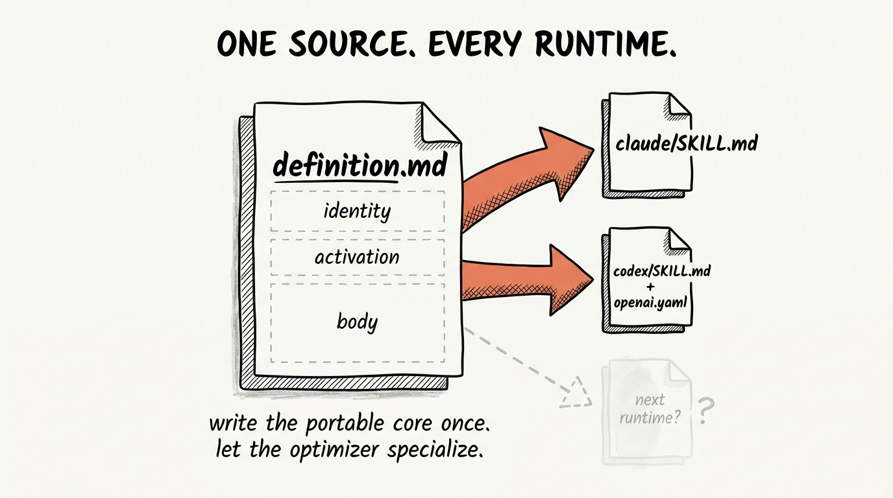
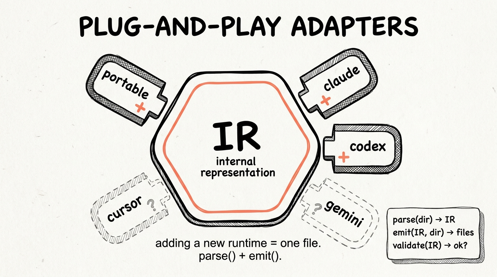
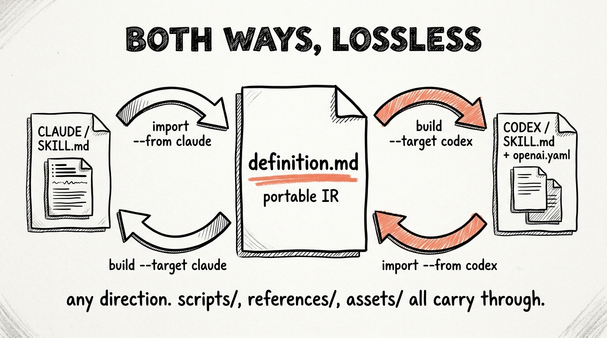

# polyskill

[](https://opensource.org/licenses/MIT)
[](https://www.typescriptlang.org/)
[](https://agentskills.io)
[](#contributing)

> **Cross-runtime Agent Skills.** Write your skill once in a portable format. Polyskill compiles it into Claude Code and OpenAI Codex variants, each optimized for the target runtime.



After install, you invoke polyskill with `/polyskill <natural language>` in Claude Code or `$polyskill <natural language>` in Codex. The skill drives the CLI behind the scenes, so you never have to memorize commands.

---

## Table of contents

- [Why it exists](#why-it-exists)
- [Install (two paths)](#install-two-paths)
- [Quick start](#quick-start)
- [How it works](#how-it-works)
- [CLI reference](#cli-reference)
- [Worked example](#worked-example)
- [Drift policy](#drift-policy)
- [Roadmap](#roadmap)
- [Contributing](#contributing)
- [Community](#community)
- [License](#license)

---

## Why it exists

The Agent Skills standard ([agentskills.io](https://agentskills.io)) is now implemented by 40+ tools. The portable core that Claude Code and OpenAI Codex genuinely agree on is exactly four things.

1. The `SKILL.md` filename
2. The `name` and `description` frontmatter fields
3. The markdown body
4. The `scripts/` / `references/` / `assets/` directory convention

Everything else is runtime-specific. Claude Code has dynamic injection (the backtick-bang syntax that runs a shell command before reading the skill). Codex has a hidden description-length cap and a separate `agents/openai.yaml` sidecar for UI metadata and MCP server dependencies. Both honor different field-name conventions in the frontmatter.

Polyskill is the seam. Write the portable core once. Get a runtime-optimized output for each target, two-way.

---

## Install (two paths)

### Path A. Drag and drop (no CLI required)

The repo ships pre-built `dist/` outputs for the polyskill meta-skill itself. Copy them straight into your skills directories.

```bash
# Claude Code
cp -r skill/dist/claude/polyskill ~/.claude/skills/polyskill

# OpenAI Codex
cp -r skill/dist/codex/polyskill ~/.agents/skills/polyskill
```

Claude Code live-reloads, so `/polyskill` works immediately. In Codex, open the desktop app, go to Plugins, click refresh.

> ⚠️ Path A installs the polyskill **skill** but not the polyskill **CLI**. The skill will respond to natural-language requests, but if it needs to actually run `polyskill build` or `polyskill install` behind the scenes, the CLI also needs to be on PATH. See Path B Step 1.

### Path B. Source + CLI (for builders)

```bash
git clone https://github.com/earlyaidopters/polyskill
cd polyskill
npm install
npm run build
npm link
```

Verify the CLI is reachable.

```bash
polyskill --version
polyskill detect    # confirms both Claude Code and Codex are seen
```

Install polyskill itself into both runtimes from the meta-skill workspace.

```bash
cd skill
polyskill install
```

Expected output.

```
✓ Claude Code     → ~/.claude/skills/polyskill
✓ OpenAI Codex    → ~/.agents/skills/polyskill
```

---

## Quick start

After install, you invoke polyskill with natural language in either runtime.

```
/polyskill convert my y-compare skill to work in both runtimes
$polyskill convert my y-compare skill to work in both runtimes
```

The polyskill skill picks up the request, runs the right CLI commands, and reports back. No flag memorization required.

If you'd rather drive the CLI directly, see the [CLI reference](#cli-reference) below.

---

## How it works



Polyskill has three pieces.

1. **The shared structure (Internal Representation).** A neutral version of everything a skill needs to be, that's not tied to any specific tool.
2. **The adapters.** One file per runtime. Each adapter knows how to read AND write that runtime's skill format. Plug one in, the tool is supported. Pull it out, it's gone.
3. **The CLI.** What you actually run on the command line. Orchestrates the adapters.

Adding a new tool is literally one file. You write the adapter, you register it, and the CLI / validator / builder / reconciler all pick it up automatically through the registry.

See `src/adapters/codex.ts` for a worked example.

---

## CLI reference

```bash
polyskill init <name>                   # bootstrap a new portable skill workspace
polyskill import <path> --from claude   # import an existing Claude Code skill
polyskill import <path> --from codex    # import an existing Codex skill
polyskill build                         # emit to all configured targets
polyskill install                       # build + copy into ~/.claude/skills + ~/.agents/skills
polyskill detect                        # show which runtimes are installed on this machine
polyskill status                        # which targets are in sync with the last build
polyskill validate                      # lint the definition against each target's rules
polyskill reconcile                     # explain how to resolve drifted target files
polyskill adapters                      # list installed runtime adapters
```

### What each adapter does

| Adapter | Reads and writes | Notable transforms |
|---|---|---|
| **portable** | `definition.md` (YAML frontmatter + markdown body) | The canonical source. Round-trip target. |
| **claude** | `SKILL.md` with `allowed-tools`, `disable-model-invocation`, etc. | Preserves dynamic injection (the backtick-bang syntax). |
| **codex** | `SKILL.md` + `agents/openai.yaml` sidecar | Front-loads the description for the ~8K catalog cap. Rewrites dynamic injection as fallback prose. Maps MCP deps into the sidecar. Emits the `openai.yaml` manifest. |

---

## Worked example

`examples/hello-skill/` exercises every cross-runtime primitive (dynamic injection, MCP dependencies, bash patterns, front-loaded descriptions). The `dist/` folder is committed so you can see what polyskill produces from a source definition without running anything.

### Authoring your own portable skill

```bash
polyskill init my-skill
cd my-skill
# edit definition.md
polyskill build
```

Result. `dist/claude/my-skill/SKILL.md` and `dist/codex/my-skill/SKILL.md` (plus `dist/codex/my-skill/agents/openai.yaml` if you declared branding or MCP deps).

When you're ready to install everywhere.

```bash
polyskill install
```

### Round-trip example



```bash
# Start from an existing Claude Code skill.
polyskill import ~/.claude/skills/some-skill --from claude

# You now have a portable workspace. Build for both targets.
cd some-skill
polyskill build

# Validate per-target rules.
polyskill validate
```

Going the other direction (Codex to Claude Code) works the same way with `--from codex`. Supporting files (`scripts/`, `references/`, `assets/`) carry through both ways.

---

## Drift policy

By default, `polyskill build` hashes every output file. If a target file was hand-edited externally between builds, the build aborts and asks you to either rerun with `--force` or use `polyskill reconcile` to inspect the drift.

This protects hand-tuned target files from getting silently overwritten.

---

## Roadmap

Built-in adapters (today):

- ✅ Claude Code
- ✅ OpenAI Codex
- ✅ Portable (the canonical source format)

Planned, in priority order:

- 🔜 Gemini CLI
- 🔜 Cursor
- 🔜 GitHub Copilot
- 🔜 JetBrains AI Assistant

Want a runtime added sooner? Open an issue with the target's skill-format documentation linked, or open a PR with a draft adapter. The bar is `parse` + `emit` + a few validation rules.

---

## Contributing

Pull requests welcome. The fastest contribution path is a new adapter for a runtime that already supports the Agent Skills standard.

1. Fork the repo.
2. Drop a new file at `src/adapters/<name>.ts` implementing the `Adapter` interface (`parse`, `emit`, `validate`).
3. Add one line to `src/adapters/index.ts`: `register(new YourAdapter());`
4. Add a worked example in `examples/<name>-example/` so reviewers can verify the round-trip.
5. Open the PR. Tag it `new-adapter`.

For bug reports, please include the skill workspace that reproduces the issue (or a redacted version), plus the output of `polyskill --version` and `polyskill detect`.

---

## Community

The patterns behind polyskill, regular updates as new runtimes get adapters, and a working group of builders shipping their own cross-runtime tools all live in the Early AI Dopters community.

https://www.skool.com/earlyaidopters/about

There's also a companion video walking through the architecture and a live demo. Drop a comment if you build something interesting on top of this.

---

## Acknowledgments

Built on the open Agent Skills standard at [agentskills.io](https://agentskills.io), originally developed by Anthropic and released as an open spec. Polyskill takes no position on which runtime is best, only that your skills shouldn't have to.

---

## License

[MIT](LICENSE). Open source. Contributions welcome.
